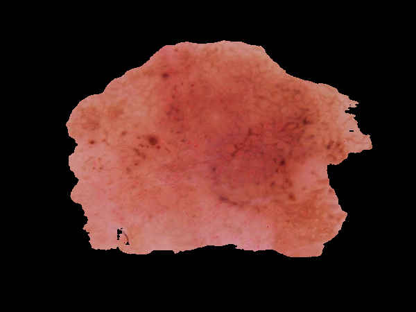
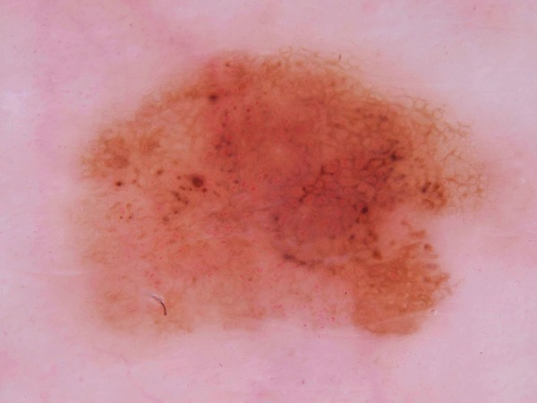

# Masked vs raw: training experiment

_Generated 2026-09-14 16:29 UTC_
Updated by Lynn Trickey 2026 9-15

Does SAM masking help or hurt classification, and if it hurts, is it because the classifier never saw masked input, or because the masks themselves were bad? Three models are fine-tuned on identical images — SAM-masked, untouched, and masked with expert ground-truth boundaries — and each is scored against every input type.

## Dataset

- **2548** images from HAM10000, each written three ways: SAM-masked, untouched, and ground-truth-masked, so every training arm sees identical source images.
- SAM found a coherent mask on **1816**; **732** (29%) had none and were passed through unchanged — identical to the raw copy, which dilutes the contrast.
- Expert masks covered **2548** images with **0** missing — no fallbacks at all, against SAM's 29%. Mean lesion coverage **29.6%**.

| class | images |
|---|---|
| akiec | 315 |
| bcc | 487 |
| bkl | 500 |
| df | 110 |
| mel | 500 |
| nv | 500 |
| vasc | 136 |

HAM10000 is imbalanced by nature (`df` and `vasc` are genuinely rare), which is why balanced accuracy is reported alongside raw accuracy.

## Segmentation quality

This pipeline prompts SAM zero-shot with a centre point. Himel et al. report IoU 96.01% from a segmenter *trained* on these same masks, so this is the gap between prompting and training. Scored on the same 408-image test split as every accuracy number above.

| metric | value |
|---|---|
| mean IoU (fallbacks counted as 0) | 0.396 |
| mean IoU (fallbacks excluded) | 0.585 |
| mean Dice | 0.476 |
| fallback rate | 32.4% (132/408) |
| Himel et al. reported IoU | 0.960 |

Both IoU figures are given on purpose. Counting fallbacks as 0 is what the pipeline actually delivers, since a fallback passes the whole unmasked image through. Excluding them says how well SAM does when it commits to a lesion at all. Quoting only the second would flatter it.

## Training

- base model: `google/vit-base-patch32-224-in21k`
- epochs: 10
- split (grouped by lesion, so no lesion spans folds): train 1760 / val 380 / test 408

Each arm is scored on the preprocessing it was trained for:

| arm | accuracy | balanced accuracy |
|---|---|---|
| trained on **SAM-masked** | 63.7% | 56.3% |
| trained on **raw** | 73.8% | 70.1% |
| trained on **ground-truth-masked** | 66.9% | 62.8% |

## Model × input grid

Balanced accuracy for every trained model against every input variant. The diagonal is each model on its own preprocessing; the off-diagonal is the cost of a mismatch.

|  | tested on SAM-masked | tested on raw | tested on ground-truth-masked |
|---|---|---|---|
| trained on **SAM-masked** | 56.3% | 55.5% | 57.9% |
| trained on **raw** | 50.9% | 70.5% | 34.1% |
| trained on **ground-truth-masked** | 39.6% | 26.8% | 63.4% |

## Where the accuracy goes

Masking costs **7.0 points** of balanced accuracy even with expert masks on every image. SAM masks cost **14.2**, so roughly **7.1 points** of the original result was poor segmentation rather than masking itself — and the remainder is the cost of masking done as well as it can be done here.

### SAM masks

| effect | points | meaning |
|---|---|---|
| mismatch cost | −19.6 | raw-trained model fed masked input |
| recovered by retraining | +5.4 | training on masked removes the mismatch |
| residual loss | −14.2 | never recovered — information the mask removed |

Retraining recovers 5.4 of the 19.6 points lost, leaving 14.2 unrecovered — so most of the damage is not a mismatch at all. Training on masked images barely helps, which means the masking is destroying information the classifier needs rather than merely presenting it unfamiliarly.

### ground-truth masks

| effect | points | meaning |
|---|---|---|
| mismatch cost | −36.4 | raw-trained model fed masked input |
| recovered by retraining | +29.4 | training on masked removes the mismatch |
| residual loss | −7.0 | never recovered — information the mask removed |

Retraining recovers 29.4 of the 36.4 points lost, leaving 7.0 unrecovered — so most of the damage is a distribution mismatch that training can fix, though a real remainder is lost signal.

## Examples

What the two inputs actually look like:

**mel_ISIC_0024351**

| masked | raw |
|---|---|
|  |  |

_2 further pair(s) omitted: SAM found no coherent mask, so the masked and raw inputs are identical._

## Caveats

- Single run, single seed, no error bars.
- Masking blacks out the background at the original framing; it does not crop, so framing and scale are held constant between arms.
- Lesion pixels keep their colour. Himel et al.'s wording ("converted to binary masking", white = lesion / black = everything else) more likely means their ViT saw the bare silhouette. Keeping the pixels is the more generous reading, so these numbers are an upper bound on how well their stated preprocessing could do.
- Images where SAM found no coherent mask are identical in both arms, which understates the true contrast.
- 7-class, lesion-grouped split. Not comparable to published binary HAM10000 numbers, which are typically much higher due to 2 class problem and likely data leakage.
- Himmel paper used 30 epochs and larger dataset with duplicate images (cropped or transformed) to increase dataset.  When we tried 30 epochs with this size dataset, our model suffered from overfitting.
